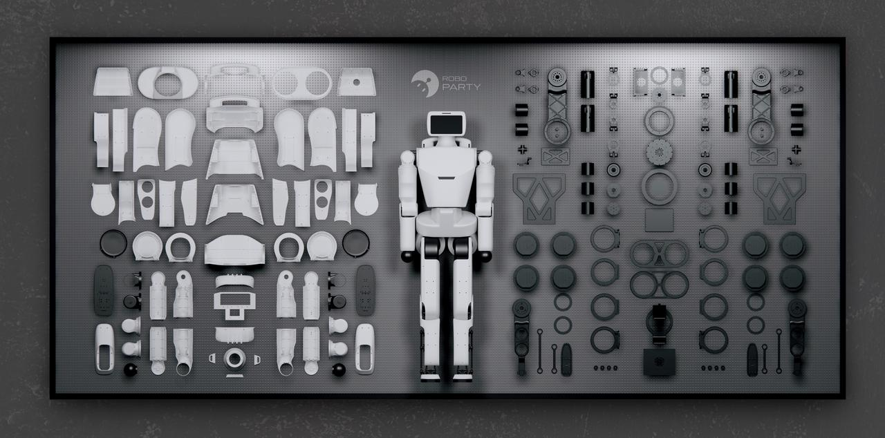
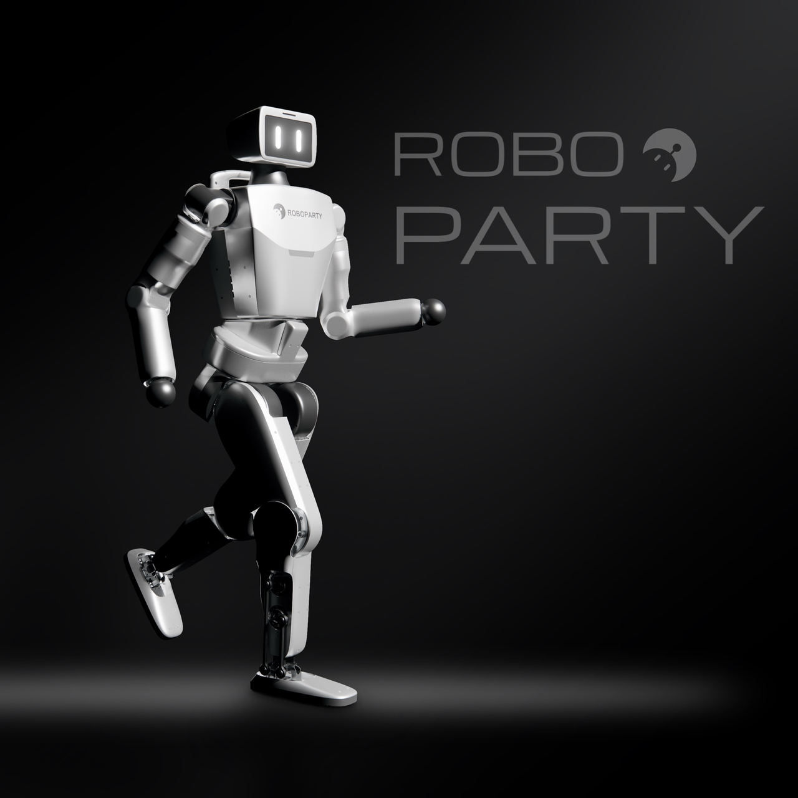

# ROBOTO_ORIGIN ——全开源手搓级人形机器人

[](https://www.gnu.org/licenses/gpl-3.0) [](https://docs.ros.org/en/humble/index.html) [](https://docs.omniverse.nvidia.com/isaacsim/latest/overview.html) [](https://isaac-sim.github.io/IsaacLab) [](https://docs.python.org/3/whatsnew/3.10.html) [](https://en.cppreference.com/w/C++17) [](https://ubuntu.com/) [](https://github.com/Roboparty) [](https://github.com/leggedrobotics/rsl_rl)

---



## 关于我们

我们是 **RoboParty**，成立于2025年2月21日。四月份我们开始正式做人形机器人，经历四个月完成了原型机的研发，也就是这台 **ROBOTO_ORIGIN**。我们一直秉持着开源的理念，**ROBOTO_ORIGIN**的全研发流程和全部的结构、电气、训练、部署都进行了开源。

随着我们逐步推进新机器人的研发，我们发现一台高性能的机器人远远不是手搓所能达到的，所以我们决定将这台能跑能跳的原型机正式开源，以记录我们的来时路。

**ROBOTO_ORIGIN**可以完全通过淘宝采购和嘉立创打样完成，真正仅靠自己手搓便能完全组装。依靠我们提供的开源训练代码和部署代码，能轻松实现行走跑步的基础功能。后续我们也将逐步把我们在这台机器人上实现的更多算法添加到开源仓库中。在此之上，作为一台全开源机器人，它的功能可以由广大开发者和使用者定义，因此，创意工坊也会稍后上线。

---




---

## 资源指引

### 仓库模块

| 模块名称            | 介绍                                                                                              | 仓库链接                                     |
| ------------------- | ------------------------------------------------------------------------------------------------- | -------------------------------------------- |
| **Atom01_hardware** | Atom01机器人的硬件设计文件，包含结构图纸和设计资料                                                | https://github.com/Roboparty/Atom01_hardware |
| **atom01_deploy**   | ROS2部署框架，提供模块化架构的中间件，用于机器人部署和控制，支持IMU、电机驱动、推理等功能         | https://github.com/Roboparty/atom01_deploy   |
| **atom01_train**    | 基于IsaacLab的直接训练工作流，提供高透明度和低重构难度的强化学习训练环境，支持Sim2Sim迁移到MuJoCo | https://github.com/Roboparty/atom01_train    |
| **atom01_urdf**     | Atom01机器人的URDF模型文件，包含机器人运动学和动力学描述，用于仿真和可视化                        | https://github.com/Roboparty/atom01_urdf     |

---

## 快速开始

```bash
# 克隆仓库
git clone <本仓库地址>

# 更新仓库
git pull
```

进入各模块目录 `modules/...`，按照模块内 README 指引即可。

---

**本项目采用 GNU General Public License Version 3 (GPLv3) 许可证。详见 [LICENSE](LICENSE) 文件。**
